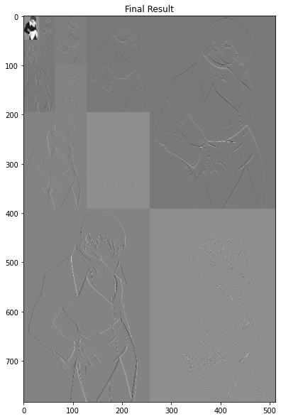
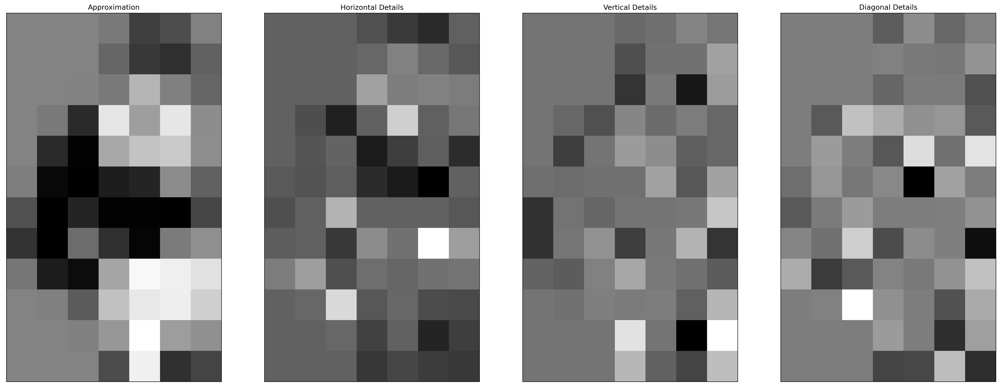
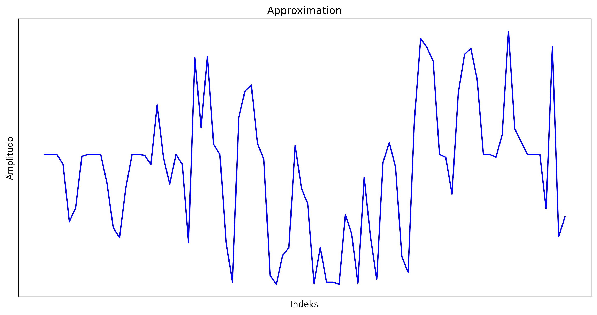
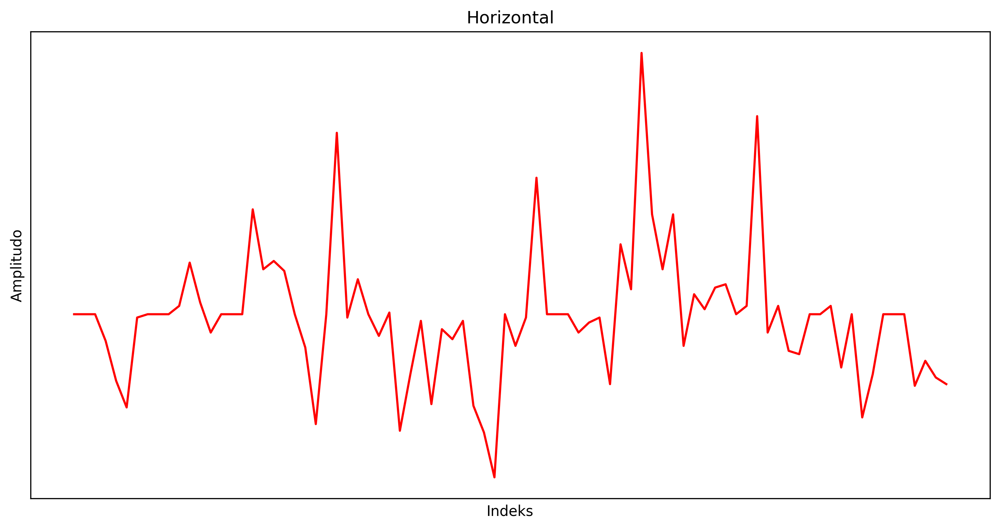
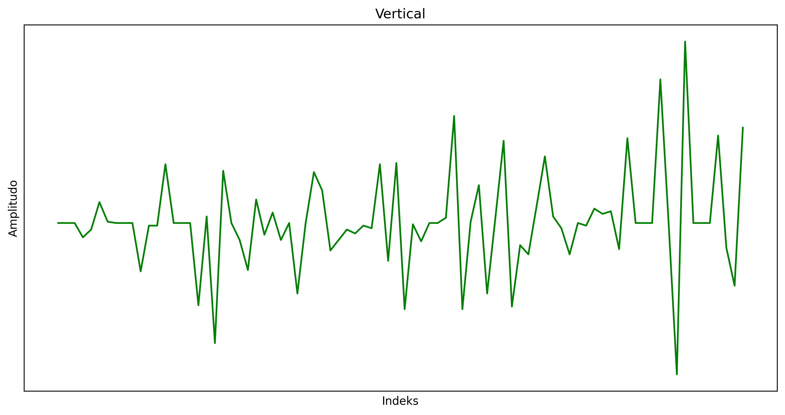
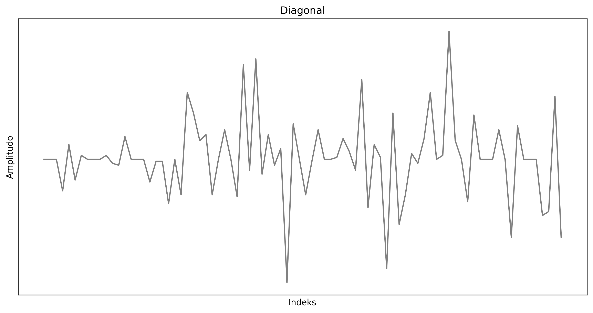

# MODUL 3 Jurnal EzPz

## Soal❗❗

1. Melakukan dekomposisi citra  
   
2. Melakukan rekonstruksi dari hasil dekomposisi  
3. Melakukan dekomposisi citra pada level 3,4,5 . . . secara dinamis  
   
4. Pada level berapa hasil dari dekomposisi berikut? berikan alasannya  
   
5. Menampilkan representasi sinyal pada hasil dekomposisi pada nomor 4  
   
   
   
   

